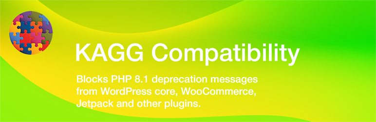

# KAGG Compatibility

The plugin blocks error messages of any level from WordPress core, plugins, and themes.

[WordPress is not fully compatible with PHP 8.0 - 8.3](https://make.wordpress.org/core/handbook/references/php-compatibility-and-wordpress-versions/). Remaining known PHP 8.0+ issues are deprecation notices.

The same is related to many popular plugins such as WooCommerce, Jetpack, Gravity Forms and others. Mainly, they produce deprecation notices from the Action Scheduler library.



## Features

* The plugin blocks deprecation notices, user deprecation notices, notices, warnings, user notices, and user warnings.
* The list of folders from which errors are blocked can be filtered. This list may specify any WordPress Core, plugin and theme folders.
* Plugin filters out errors from these folders only. Errors produced by other code are not blocked, which helps in debugging user code.
* During activation, plugin installs a mu-plugin `kagg-compatibility-error-handler.php` into the `/wp-content/mu-plugins/` folder. It contains the error handler, which loads earlier than any plugin or theme.

## Installation

```
git clone https://github.com/kagg-design/kagg-compatibility.git
cd kagg-compatibility
composer install --no-dev
```

## Development

```
git clone https://github.com/kagg-design/kagg-compatibility.git
cd kagg-compatibility
composer install
```

## License

The WordPress Plugin KAGG Compatibility is licensed under the GPL v2 or later.

> This program is free software; you can redistribute it and/or modify it under the terms of the GNU General Public License, version 2, as published by the Free Software Foundation.

> This program is distributed in the hope that it will be useful, but WITHOUT ANY WARRANTY; without even the implied warranty of MERCHANTABILITY or FITNESS FOR A PARTICULAR PURPOSE. See the GNU General Public License for more details.

> You should have received a copy of the GNU General Public License along with this program; if not, write to the Free Software Foundation, Inc., 51 Franklin St, Fifth Floor, Boston, MA 02110-1301 USA

A copy of the license is included in the root of the plugin’s directory. The file is named `LICENSE`.

## Credits

The current version of the KAGG Compatibility was developed by KAGG Design.
