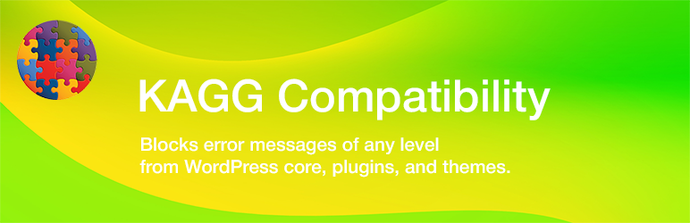

# KAGG Compatibility

The plugin blocks PHP 8.1 deprecation messages from WordPress core, WooCommerce, Jetpack and other plugins.

[WordPress is not fully compatible with PHP 8.0 or 8.1](https://make.wordpress.org/core/2022/01/10/wordpress-5-9-and-php-8-0-8-1/). All remaining known PHP 8.1 issues are deprecation notices.

The same is related to many popular plugins such as WooCommerce, Jetpack and others. Mainly, they produce deprecation notices from the Action Scheduler library.



## Features

* Plugin blocks all deprecation notices from WordPress core, WooCommerce, JetPack and many others using Action Scheduler library.
* Plugin filters out errors from these libraries only. Errors produced by the user code are not blocked, which helps to debug.
* During activation, plugin installs a mu-plugin `kagg-compatibility-error-handler.php` into the `/wp-content/mu-plugins/` folder. It contains the error handler, which loads earlier than any plugin or theme.

## Installation

```
git clone https://github.com/kagg-design/kagg-compatibility.git
cd kagg-compatibility
composer install --no-dev
```

## Development

```
git clone https://github.com/kagg-design/kagg-compatibility.git
cd kagg-compatibility
composer install
```

## License

The WordPress Plugin KAGG Compatibility is licensed under the GPL v2 or later.

> This program is free software; you can redistribute it and/or modify it under the terms of the GNU General Public License, version 2, as published by the Free Software Foundation.

> This program is distributed in the hope that it will be useful, but WITHOUT ANY WARRANTY; without even the implied warranty of MERCHANTABILITY or FITNESS FOR A PARTICULAR PURPOSE. See the GNU General Public License for more details.

> You should have received a copy of the GNU General Public License along with this program; if not, write to the Free Software Foundation, Inc., 51 Franklin St, Fifth Floor, Boston, MA 02110-1301 USA

A copy of the license is included in the root of the plugin’s directory. The file is named `LICENSE`.

## Credits

The current version of the KAGG Compatibility was developed by KAGG Design.
